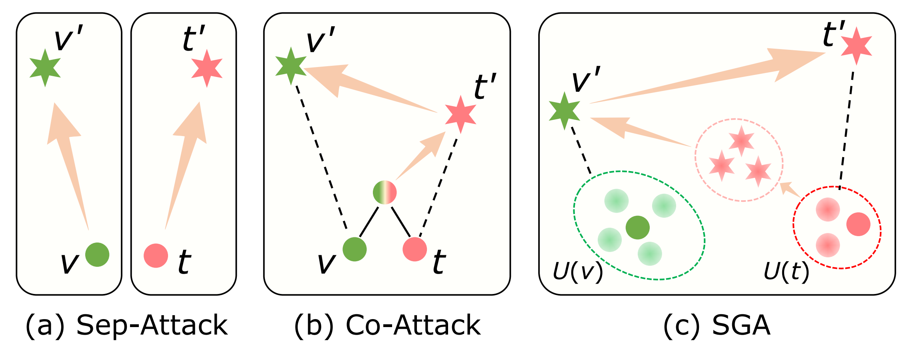

# Set-level Guidance Attack

The official repository for Set-level Guidance Attack (SGA).  
ICCV 2023 Paper: *Set-level Guidance Attack: Boosting Adversarial Transferability of Vision-Language Pre-training Models* (https://arxiv.org/abs/2307.14061)

Please feel free to contact wangzq_2021@outlook.com if you have any question.


## Brief Introduction
Vision-language pre-training (VLP) models have shown vulnerability to adversarial attacks. However, existing works mainly focus on the adversarial robustness of VLP models in the white-box settings. In this work, we inverstige the robustness of VLP models in the black-box setting from the perspective of adversarial transferability. We propose *Set-level Guidance Attack (SGA)*, which can generate highly transferable adversarial examples aimed for VLP models.

## Quick Start 
### 1. Install dependencies
See in `requirements.txt`.

### 2. Prepare datasets and models
Download the datasets, [Flickr30k](https://shannon.cs.illinois.edu/DenotationGraph/) and [MSCOCO](https://cocodataset.org/#home) (the annotations is provided in ./data_annotation/). Set the root path of the dataset in `./configs/Retrieval_flickr.yaml, image_root`.  
The checkpoints of the fine-tuned VLP models is accessible in [ALBEF](https://github.com/salesforce/ALBEF), [TCL](https://github.com/uta-smile/TCL), [CLIP](https://huggingface.co/openai/clip-vit-base-patch16).

### 3. Attack evaluation
```python
python eval_albef2clip-vit_flickr.py --config ./configs/Retrieval_flickr.yaml \
--source_model ALBEF  --source_ckpt ./checkpoint/albef_retrieval_flickr.pth \
--target_model ViT-B/16 --original_rank_index ./std_eval_idx/flickr30k/ \
--scales 0.5,0.75,1.25,1.5
```

## Transferability Evaluation
Existing adversarial attacks for VLP models cannot generate highly transferable adversarial examples.  
(Note: *Sep-Attack* indicates the simple combination of two unimodal adversarial attacks: [PGD](https://arxiv.org/abs/1706.06083) and [BERT-Attack](https://arxiv.org/abs/2004.09984))

<table style="border-collapse: collapse; width: 100%;">
    <thead>
        <tr><th rowspan="2">Attack</th><th colspan="2">ALBEF*</th><th colspan="2">TCL</th><th colspan="2">CLIP<sub>ViT</sub></th><th colspan="2">CLIP<sub>CNN</sub></th></tr>
        <tr><th>TR R@1*</th><th>IR R@1*</th><th>TR R@1</th><th>IR R@1</th><th>TR R@1</th><th>IR R@1</th><th>TR R@1</th><th>IR R@1</th></tr>
    </thead>
    <tbody>
        <tr><td>Sep-Attack</td><td>65.69</td><td>73.95</td><td>17.60</td><td>32.95</td><td>31.17</td><td><strong>45.23</strong></td><td>32.82</td><td>45.49</td></tr>
        <tr><td>Sep-Attack + MI</td><td>58.81</td><td>65.25</td><td>16.02</td><td>28.19</td><td>23.07</td><td>36.98</td><td>26.56</td><td>39.31</td></tr>
        <tr><td>Sep-Attack + DIM</td><td>56.41</td><td>64.24</td><td>16.75</td><td>29.55</td><td>24.17</td><td>37.60</td><td>25.54</td><td>38.77</td></tr>
        <tr><td>Sep-Attack + PNA_PO</td><td>40.56</td><td>53.95</td><td>18.44</td><td>30.98</td><td>22.33</td><td>37.02</td><td>26.95</td><td>38.63</td></tr>
        <tr><td>Co-Attack</td><td>77.16</td><td>83.86</td><td>15.21</td><td>29.49</td><td>23.60</td><td>36.48</td><td>25.12</td><td>38.89</td></tr>
        <tr><td>Co-Attack + MI</td><td>64.86</td><td>75.26</td><td>25.40</td><td>38.69</td><td>24.91</td><td>37.11</td><td>26.31</td><td>38.97</td></tr>
        <tr><td>Co-Attack + DIM</td><td>47.03</td><td>62.28</td><td>22.23</td><td>35.45</td><td>25.64</td><td>38.50</td><td>26.95</td><td>40.58</td></tr>
        <tr style="background-color: #EEEEEE;"><td>SGA</td><td><strong>97.24</strong></td><td><strong>97.28</strong></td><td><strong>45.42</strong></td><td><strong>55.25</strong></td><td><strong>33.38</strong></td><td>44.16</td><td><strong>34.93</strong></td><td><strong>46.57</strong></td></tr>
    </tbody>
</table>


The performance of SGA on four VLP models (ALBEF, TCL, CLIP<sub>ViT</sub> and CLIP<sub>CNN</sub>), the Flickr30k dataset.

<table style="border-collapse: collapse; width: 100%;">
    <thead>
        <tr><th rowspan="2">Source</th><th rowspan="2">Attack</th><th colspan="2">ALBEF</th><th colspan="2">TCL</th><th colspan="2">CLIP<sub>ViT</sub></th><th colspan="2">CLIP<sub>CNN</sub></th></tr>
        <tr><th>TR R@1</th><th>IR R@1</th><th>TR R@1</th><th>IR R@1</th><th>TR R@1</th><th>IR R@1</th><th>TR R@1</th><th>IR R@1</th></tr>
    </thead>
<tbody>
    <!-- ALBEF -->
    <tr><td rowspan="5">ALBEF</td><td>PGD</td><td>52.45*</td><td>58.65*</td><td>3.06</td><td>6.79</td><td>8.96</td><td>13.21</td><td>10.34</td><td>14.65</td></tr>
    <tr><td>BERT-Attack</td><td>11.57*</td><td>27.46*</td><td>12.64</td><td>28.07</td><td>29.33</td><td>43.17</td><td>32.69</td><td>46.11</td></tr>
    <tr><td>Sep-Attack</td><td>65.69*</td><td>73.95*</td><td>17.60</td><td>32.95</td><td>31.17</td><td><strong>45.23</strong></td><td>32.82</td><td>45.49</td></tr>
    <tr><td>Co-Attack</td><td>77.16*</td><td>83.86*</td><td>15.21</td><td>29.49</td><td>23.60</td><td>36.48</td><td>25.12</td><td>38.89</td></tr>
    <tr style="background-color: #EEEEEE;"><td>SGA</td><td><strong>97.24±0.22*</td><td><strong>97.28±0.15*</td><td><strong>45.42±0.60</td><td><strong>55.25±0.06</td><td><strong>33.38±0.35</td><td>44.16±0.25</td><td><strong>34.93±0.99</td><td><strong>46.57±0.13</td></tr>
</tbody>
<tbody>
    <!-- TCL -->
    <tr><td rowspan="5">TCL</td><td>PGD</td><td>6.15</td><td>10.78</td><td>77.87*</td><td>79.48*</td><td>7.48</td><td>13.72</td><td>10.34</td><td>15.33</td></tr>
    <tr><td>BERT-Attack</td><td>11.89</td><td>26.82</td><td>14.54*</td><td>29.17*</td><td>29.69</td><td>44.49</td><td>33.46</td><td>46.07</td></tr>
    <tr><td>Sep-Attack</td><td>20.13</td><td>36.48</td><td>84.72*</td><td>86.07*</td><td>31.29</td><td>44.65</td><td>33.33</td><td>45.80</td></tr>
    <tr><td>Co-Attack</td><td>23.15</td><td>40.04</td><td>77.94*</td><td>85.59*</td><td>27.85</td><td>41.19</td><td>30.74</td><td>44.11</td></tr>
    <tr style="background-color: #EEEEEE;"><td>SGA</td><td><strong>48.91±0.74</td><td><strong>60.34±0.10</td><td><strong>98.37±0.08*</td><td><strong>98.81±0.07*</td><td><strong>33.87±0.18</td><td><strong>44.88±0.54</td><td><strong>37.74±0.27</td><td><strong>48.30±0.34</td></tr>
</tbody> 
<tbody>
    <!-- CLIP ViT -->
    <tr><td rowspan="5">CLIP<sub>ViT</sub></td><td>PGD</td><td>2.50</td><td>4.93</td><td>4.85</td><td>8.17</td><td>70.92*</td><td>78.61*</td><td>5.36</td><td>8.44</td></tr>
    <tr><td>BERT-Attack</td><td>9.59</td><td>22.64</td><td>11.80</td><td>25.07</td><td>28.34*</td><td>39.08*</td><td>30.40</td><td>37.43</td></tr>
    <tr><td>Sep-Attack</td><td>9.59</td><td>23.25</td><td>11.38</td><td>25.60</td><td>79.75*</td><td>86.79*</td><td>30.78</td><td>39.76</td></tr>
    <tr><td>Co-Attack</td><td>10.57</td><td>24.33</td><td>11.94</td><td>26.69</td><td>93.25*</td><td>95.86*</td><td>32.52</td><td>41.82</td></tr>
    <tr style="background-color: #EEEEEE;"><td>SGA</td><td><strong>13.40±0.07</td><td><strong>27.22±0.06</td><td><strong>16.23±0.45</td><td><strong>30.76±0.07</td><td><strong>99.08±0.08*</td><td><strong>98.94±0.00*</td><td><strong>38.76±0.27</td><td><strong>47.79±0.58</td></tr>
</tbody>
<tbody>
    <!-- CLIP_CNN -->
    <tr><td rowspan="5">CLIP<sub>CNN</sub></td><td>PGD</td><td>2.09</td><td>4.82</td><td>4.00</td><td>7.81</td><td>1.10</td><td>6.60</td><td>86.46*</td><td>92.25*</td></tr>
    <tr><td>BERT-Attack</td><td>8.86</td><td>23.27</td><td>12.33</td><td>25.48</td><td>27.12</td><td>37.44</td><td>30.40*</td><td>40.10*</td></tr>
    <tr><td>Sep-Attack</td><td>8.55</td><td>23.41</td><td>12.64</td><td>26.12</td><td>28.34</td><td>39.43</td><td>91.44*</td><td>95.44*</td></tr>
    <tr><td>Co-Attack</td><td>8.79</td><td>23.74</td><td>13.10</td><td>26.07</td><td>28.79</td><td>40.03</td><td>94.76*</td><td>96.89*</td></tr>
    <tr style="background-color: #EEEEEE;"><td>SGA</td><td><strong>11.42±0.07</td><td><strong>24.80±0.28</td><td><strong>14.91±0.08</td><td><strong>28.82±0.11</td><td><strong>31.24±0.42</td><td><strong>42.12±0.11</td><td><strong>99.24±0.18*</td><td><strong>99.49±0.05*</td></tr>
</tbody>
</table>


## Visualization
<p align="left">
    
</p>

### Citation
Kindly include a reference to this paper in your publications if it helps your research:
```
@misc{lu2023setlevel,
    title={Set-level Guidance Attack: Boosting Adversarial Transferability of Vision-Language Pre-training Models},
    author={Dong Lu and Zhiqiang Wang and Teng Wang and Weili Guan and Hongchang Gao and Feng Zheng},
    year={2023},
    eprint={2307.14061},
    archivePrefix={arXiv},
    primaryClass={cs.CV}
}
```
